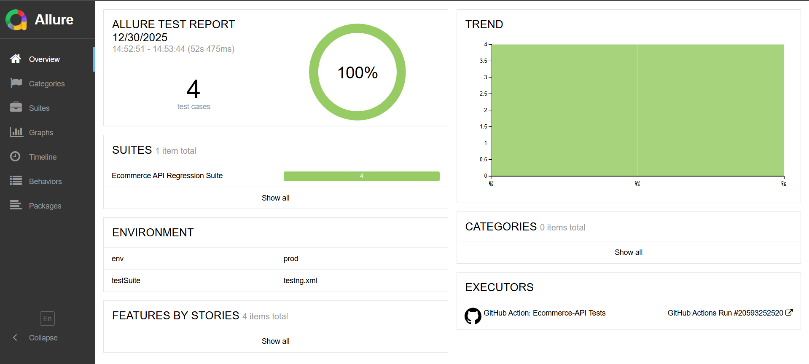
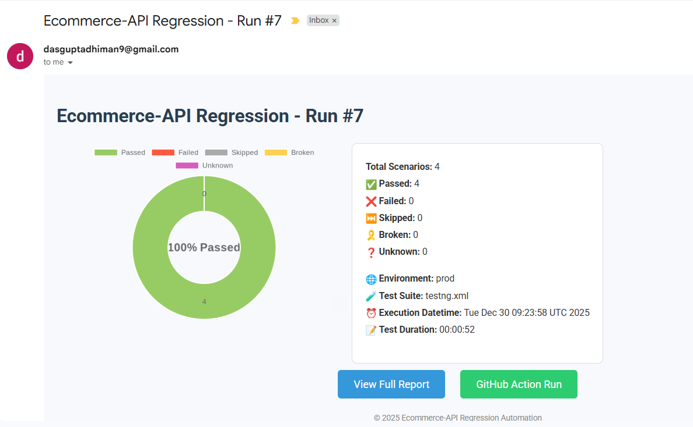

# 🧪 E-Commerce End-to-End API Automation Framework

## 📌 Project Overview

This repository contains **a production-grade, CI/CD-ready end-to-end API automation framework built using public e-commerce APIs (DummyJSON).**

The framework validates **complete business workflows** rather than isolated endpoints, closely mirroring how modern product companies test backend systems.

### 🔄 End-to-End Flows Covered

- Product search & listing validation
- Product details verification
- Add products to cart
- Cart price, quantity & discount validation
- User-specific cart retrieval
- Cross-API data consistency checks

This project is designed to demonstrate **real-world SDET API automation practices**, including clean architecture, DTO-based modeling, and CI reliability.

## 🎯 Key Highlights

✅ End-to-end business flow validation (not just API contracts)  <br>
✅ DTO-based request/response modeling (Jackson)  <br>
✅ Rest Assured API automation  <br>
✅ TestNG orchestration  <br>
✅ YAML-driven test data management  <br>
✅ Environment-aware execution (local / CI)  <br>
✅ GitHub Actions CI/CD integration  <br>
✅ Allure reporting with request/response attachments  <br>
✅ Email notifications from CI pipeline <br>

## 🧱 Tech Stack
| **Layer**        | **Technology**  |
|------------------|-----------------|
| Language         | Java 17         |
| API Automation   | Rest Assured    |
| Test Framework   | TestNG          |
| Build Tool       | Maven           |
| JSON Mapping     | Jackson         |
| Reporting        | Allure          |
| CI/CD            | GitHub Actions  |
| Test Data        | YAML            |
| Version Control  | GitHub          |

## 🗂️ Project Structure
```
ecommerce-api-automation/
│
├── .github/
│   └── workflows/
│       └── api-regression.yml        # GitHub Actions CI pipeline
│
├── src/
│   ├── main/
│   │   ├── java/
│   │   │   ├── clients/               # API client layer
│   │   │   ├── models/                # DTOs (Product, Cart, etc.)
│   │   │   ├── utils/                 # Config, YAML, request builders
│   │   │   └── config/                # Environment handling
│   │   │
│   │   └── resources/
│   │       └── prod/
│   │           └── testdata/
│   │               ├── commonTestData.yml
│   │               └── dummyApi/
│   │                   └── dummyApi.yml
│   │
│   └── test/
│       └── java/
│           ├── base/                  # Base test & setup
│           ├── tests/
│           │   └── E2ETest.java       # Full end-to-end API flow
│           └── listeners/             # TestNG + Allure listeners
│
├── target/
│   └── allure-results/                # Generated at runtime
│
├── pom.xml
├── README.md
└── .gitignore
```

## 🧪 Automated API Scenarios

### 🔹 Product APIs
- Search products using query parameters
- Validate response schema and business fields
- Capture dynamic product IDs for downstream flows

### 🔹 Cart APIs
- Add multiple products to cart
- Validate cart totals, discounts, quantities
- Fetch user cart and verify consistency

### 🔹 End-to-End Validation
- Cross-API data dependency handling
- Dynamic chaining of API responses
- Assertions on calculated values (price, discounts)

## 📊 Allure Reporting

The framework integrates **Allure Reports** for rich observability:

- Request & response payload attachments
- Step-wise execution logs
- Pass / Fail / Skip visualization
- CI-generated execution history

### 📌 Allure Capabilities

- Automatic attachment of API responses
- Clear failure root-cause visibility
- CI-friendly HTML reports



## 🔁 CI/CD Pipeline (GitHub Actions)

This project is fully automated using GitHub Actions.
### 🔹 Pipeline Capabilities
- Triggered on:
  - Manual workflow dispatch
  - Code push
  - Scheduled cron runs
- Executes TestNG suite
- Generates Allure results
- Sends email notifications with execution summary

### 📌 CI Flow

```
Code Push / Schedule
↓
GitHub Actions Runner
↓
Run API TestNG Suite
↓
Generate Allure Results
↓
Email Notification
```

## 📧 Email Notification (CI Execution)

After CI execution, an automated email is sent containing:
- Build status
- Total / Passed / Failed test count
- Failed test details



## 🏃 How to Run Tests Locally

### Prerequisites
- Java 17+
- Maven

### Run all tests
`mvn clean test`

### Generate Allure report

`allure serve target/allure-results`

## ⚙️ Environment & Test Data Handling
- Environment-specific test data via YAML
- CI-safe execution (no hardcoded values)
- Dynamic test data extraction from API responses

## 🧠 Design Decisions & Best Practices
- DTO-based modeling instead of raw JSON parsing
- Clear separation of API clients and test logic
- Business-level assertions over superficial checks
- CI stability over brittle validations
- Readable and maintainable test flows

## 🚀 Future Enhancements
- OAuth-secured API flows
- Contract testing (OpenAPI / Swagger)
- Parallel API execution
- Dockerized test execution
- UI + API hybrid test flows

## 👤 Author
**Dhiman Dasgupta**  <br> **SDET | Automation Engineer** <br>
🔗 GitHub: https://github.com/Dhiman07-create  <br> 🔗 LinkedIn: https://www.linkedin.com/in/dhiman-dasgupta/

## ⭐ Why This Project Stands Out
This framework goes beyond basic API testing and demonstrates how product companies validate backend systems end-to-end, with CI/CD maturity, clean architecture, and production-quality automation practices.

